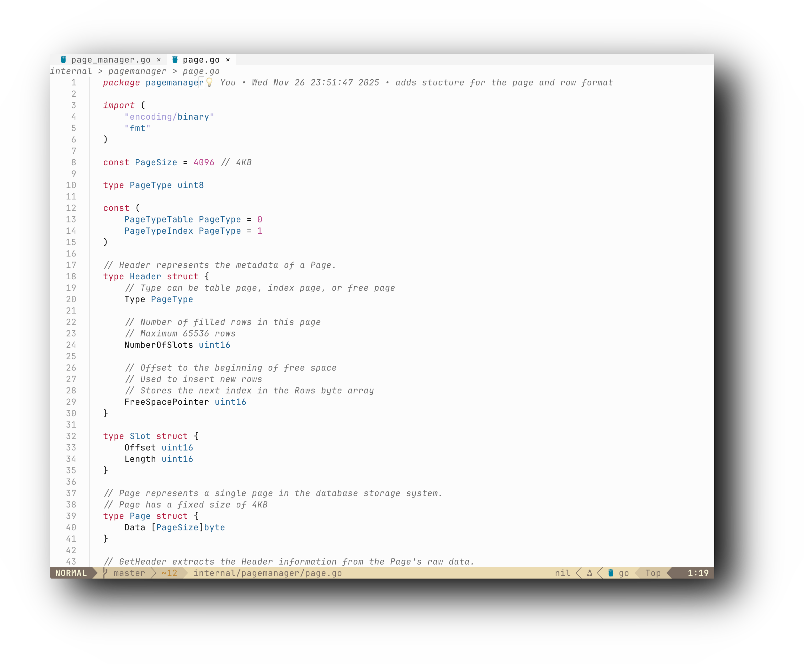

# cursor-light.nvim

A pixel-perfect Neovim theme that replicates Cursor IDE's Light theme (v0.0.2). Provides exact color matching with comprehensive syntax highlighting and LSP semantic token support.

## ✨ Features

- 🎯 **Exact color matching** - Replicated from Cursor IDE's official theme files
- 🌳 **129+ Token Rules** - Comprehensive syntax highlighting patterns
- 📐 Custom statuscolumn with line numbers and separator
- 🔍 LSP Saga breadcrumbs integration with themed highlights
- 🌲 nvim-tree integration with proper styling
- 📑 barbar integration with Cursor-style tabs
- ⚡ Language-specific optimizations (Python self, C++ this, decorators, etc.)
- 📊 Git integration with accurate diff colors

## 📸 Screenshots



## 📦 Installation

### Using [vim-plug](https://github.com/junegunn/vim-plug)

```vim
Plug 'vpoltora/cursor-light.nvim'
```

### Using [packer.nvim](https://github.com/wbthomason/packer.nvim)

```lua
use 'vpoltora/cursor-light.nvim'
```

### Using [lazy.nvim](https://github.com/folke/lazy.nvim)

```lua
{
  'vpoltora/cursor-light.nvim',
  lazy = false,
  priority = 1000,
  config = function()
    require('cursor-light').setup()
    vim.cmd.colorscheme('cursor-light')
  end,
}
```

## 🚀 Usage

### Basic Setup

The simplest way to use the theme:

```lua
-- Load the colorscheme
vim.cmd.colorscheme('cursor-light')
```

Or with explicit setup:

```lua
require('cursor-light').setup()
vim.cmd.colorscheme('cursor-light')
```

### Advanced Setup

You can customize which features to enable:

```lua
require('cursor-light').setup({
  ui = true,  -- Enable UI customizations (statuscolumn, line numbers, etc.)
  integrations = {
    lspsaga = true,    -- Enable lspsaga breadcrumbs theming
    nvim_tree = true,  -- Enable nvim-tree styling
    barbar = true,     -- Enable barbar tab styling
  },
})
```

## 🎨 Color Palette

The theme uses the exact color palette from Cursor Light v0.0.2:

| Element | Color | Hex |
|---------|-------|-----|
| Background | White | `#FCFCFC` |
| Foreground | Dark Gray | `#141414` |
| Keywords | Red | `#B31B3F` |
| Functions | Orange | `#DB704B` |
| Strings | Purple | `#9E94D5` |
| Types | Blue | `#206595` |
| Comments | Gray (italic) | `#6F6F6F` |
| Constants | Blue | `#206595` |
| Numbers | Magenta | `#B8448B` |
| Properties | Purple-Blue | `#6049B3` |
| Built-ins | Teal | `#6F9BA6` |
| Macros/Decorators | Green | `#1F8A65` |

## 🔧 Requirements

- Neovim >= 0.8.0
- Treesitter (recommended for better syntax highlighting)
- A terminal that supports true colors

## 📚 Recommended Setup

For the best experience, use with these plugins:

- `nvim-treesitter/nvim-treesitter` - Enhanced syntax highlighting
- `nvimdev/lspsaga.nvim` - Beautiful breadcrumbs in winbar
- `kyazdani42/nvim-tree.lua` - File explorer with themed styling
- `romgrk/barbar.nvim` - Tab bar with Cursor-style tabs

## 📄 License

MIT License - feel free to use this theme in your projects!

## 🙏 Credits

Inspired by [Cursor IDE](https://cursor.sh/)'s light theme.

## 💡 Tips

- Use with the JetBrains Mono font (size 13) for the authentic Cursor experience
- The theme works best with a terminal that supports italics
- Enable `termguicolors` in your Neovim config: `vim.opt.termguicolors = true`
